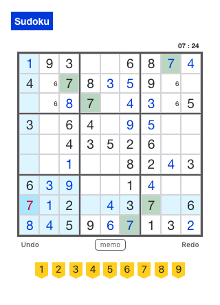

# Sudoku Generator

This program generates random Sudoku puzzles of different difficulty levels base on the methodology from [this article](https://dlbeer.co.nz/articles/sudoku.html). It also provides connection and insertion methods to the postgresQL database for a full stack Sudoku game project.

## Links to and screenshot of full stack project

- [Live Page](https://sudoku-web.now.sh/)
- [Client Repo](https://github.com/asching7108/sudoku-client/)
- [Server Repo](https://github.com/asching7108/sudoku-server/)
- Screenshot
  
	

## What is Sudoku

Sudoku is a popular Japanese puzzle game based on the logical placement of digits from 1 to 9. A sudoku puzzle is a 9 * 9 grid of cells with some values revealed and some hidden. To solve the puzzle, we need to fill in all empty cells so that:

  - Each row contains exactly one of every digit from 1 to 9.
  - Each column contains exactly one of every digit from 1 to 9.
  - Each block (3 * 3 cells) contains exactly one of every digit from 1 to 9.

In this program, We define a valid Sudoku puzzle as one that has only **one uniqle solution**. (This way we can generate Sudoku puzzles with fixed solutions.)

## Solver

To determine how difficult a user would feel when he solves a Sudoku, our first concern is how a user would solve it. There are two general approaches people use in solving a Sudoku:

  1. For each cell, find the candidate values.
  2. For each row, column and 3 * 3 block (let's call them "sets"), find the candidate empty cells for a missing value.

When a cell has only one candidate, we can simply fill it. And when no such cell can be found, we usually pick a cell with the least candidates, and use a backtracking method to try solving it with each candidate. This goes on until all empty cells are filled and the puzzle is solved.

We summarize the solving strategy as following:

  1. If no empty cell can be found, the puzzle is solved.
  2. Finds the empty cell with the smallest number of candidate values.
  3. Finds the missing value in a set with the smallest number of candidate cells.
  4. If 2 <= 3, tries filling each candidate value in the identified cell and recursively solves the puzzle.
  5. If 3 < 2, tries filling each candidate cells with the missing value and recursively solves the puzzle. 
  6. In 4/5, if all candidate are exhausted, the puzzle is not solvable.

## Difficulty and Level

### Difficulty Definition

  Difficulty formula: **sigma (Fi - 1)^2 * 100 + E** where i is each solving step, Fi is the candidate number of the ith step, and E is the number of initial empty cells.
  
  If a puzzle can be solved with only one candidate in each step, i.e. no backtracking is needed, the difficulty is equal to the number of initial empty cells.

  If solving a puzzle includes one step where there are two candidates, the difficulty is 100 + the number of initial empty cells.

  In short, puzzles with difficulties under 100 is relatively easy to solve, and puzzles with difficulties above 300 is usually considered difficult since it requires more backtracking.

### Level Definition

We define 6 levels of difficulty:

  1. Very Easy: difficulty equals 26
  2. Easy: difficulty equals 40
  3. Normal: difficulty equals to or greater than 50 and less than 100
  4. Hard: difficulty greater than 100 and less than 200
  5. Very Hard: difficulty greater than 200 and less than 300
  6. Hard: difficulty greater than 300

## Solution Board Generator

Before generating Sudoku puzzles, we need to generate the solution boards first. The basic generating approach is also a solving strategy, but we start from the upper-left corner of an empty grid, go rightward first and then downward, and follow the steps:

  1. If the lower-right corner cell is filled, it is a valid solution board.
  2. Finds all candidate values for the current cell.
  3. Fills the cell with a random candidate value and recursively fills the next cell.
  4. If all candidate are exhausted, it is not a valid solution board.

In the program we apply an optimization that we first fill in the top and left five blocks with random values, then we start the solving strategy for the left square of cells.

## Puzzle Generator

Finally, we get to generate the Sudoku puzzles.

### Generate a puzzle of random level

Given a solution board, we uses the following approach to generate a random puzzle with the maximal difficulty in a fixed number of iterations:

  1. Start by storing the solution board as the best puzzle, with a difficulty of 0.
  2. Randomly adds or removes a pair of cells from the board.
  3. If the new puzzle is uniqly solvable, with a higher difficulty than the best puzzle so far, stores it as the new best puzzle.
  4. Repeat 2 and 3 for 20 iterations.
  5. Reset the current puzzle to the stored best puzzle, and repeat 4 for a fixed number of iterations (currently set to 200).
  6. Return the best puzzle.

The reason why we need to reset the current puzzle to the best puzzle so far (which is uniqly solvable) for every 20 random operations is that without doing so, we'd spend more iterations on unsolvable or not uniqly solvable puzzles. (Trust me, I tried.)

### Generate a puzzle of a given level

The approach is similar. We modify step 3 in the above approach as follows:

  3. If the new puzzle is uniqly solvable:
    - **If it has the desired difficulty level, direct returns it**.
    - Else if its difficulty is higher than the best puzzle so far **and lower than the maximal difficulty of the given level**, stores it as the new best puzzle.

We also need to modify step 6:

  6. Return null. (A puzzle of the given level has not been generated.)

In order to control the execution time, sometimes a puzzle would not be generated (especially for higher levels). Raising the number of iteraitons would have a better chance of generating puzzles with longer execution time.